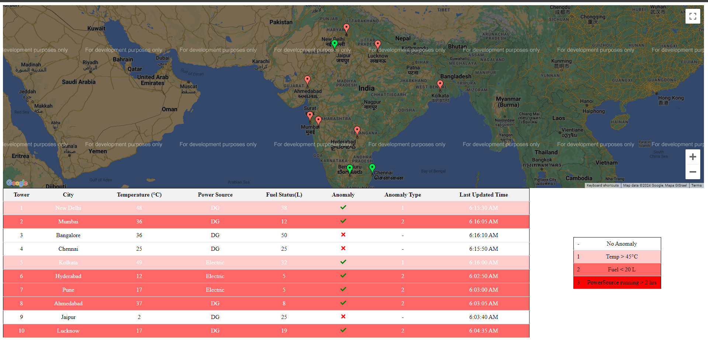
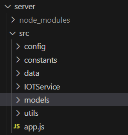

# Security Alarm System for Mobile Tower



## Table of Content
- [Overview](#Overview)
- [Getting Started](#getting-started)
- [Backend System](#backend-system)
- [Frontend System](#frontend-system)
- [Contibutors](#contributors)

## Overview

This project involves building a security alarm system for a mobile tower using Node.js, Express, MongoDB,Node-Cron and Socket.io for the backend, and ReactJS,Socket.io-client and Google Maps API for the frontend.The system generates sensor data randomly, and identify anomalies every 5 seconds and store data in MongoDB. The frontend displays alarms in real-time on a map and updates a data table with new sensor data

## Getting Started

1. Take a `git clone https://github.com/mrr-bajaj/security-alarm-system.git`
2. Open the cloned repo in IDE (Ex. VS Code) (root as `security-alarm-sytem\`)
3. Run the command `npm i && npm run install-app` in the terminal

   It will install all the dependenices of client and server

4. Create `.env` file in client and server folder respectively

   In client's .env file add this `GOOGLE_MAP_API`='YOUR_GOOGLE_API_KEY'

   In server's .env file add this `MONGODB_URI` = 'MONGODB_ATLAS_URI'

5. Run the command `npm run start-app` from the root(`security-alarm-system\`) of the application in the terminal

   It will run the client and server in different terminal

## Backend System

### Technologies Used

- Node.js
- Express
- MongoDB (Atlas)
- Node-Cron
- Socket.io

### Features

#### 1. Random Sensor Data Generation:

The backend system generates sensor data every 5 seconds for random tower with the following parameters:

```
Tower ID
Tower Location (Latitude and Longitude)
Tower Temperature (in Celsius)
Power Source (DG/Electric)
Fuel Status (in liters)
City
Time (in Date)
Anomaly Present (in true/false)
Anomaly Type (-/1/2/3)
```

#### 2. Anomaly Detection

Anomalies are introduced in the sensor data generation process:

- If temperature exceeds 45 degrees Celsius
- If fuel level drops below 20 liters
- If the power source (DG) runs continuously for more than 2 hours

#### 3. Backend Processing

- Use Node-Cron for job scheduling to create and perform anomaly checks every 5 seconds.
- Store sensor data to MongoDB.
- Read messages from MongoDB in the backend.
- Establish real-time communication with the frontend using Socket.io for live updates.

<!-- ### Folder Structure -->

<!--  -->

<!-- - `config/database.js`  Connection of MongoDB -->
<!-- - `constants/constants.js`  Constants for the server -->
<!-- - `data/towers.js`  Raw Tower Data -->
<!-- - `IOTService/generate.js`  Generate and push random data to DB -->
<!-- - `models/tower.js`  Schema of tower -->
<!-- - `utils/helper.js`  Contains helper functions -->
<!-- - `app.js`  Starting point of the server -->


## Frontend System

### Technologies Used

- ReactJS
- Socket.io-client
- Google Maps API

### User Interface

The frontend displays alarms and sensor data in real-time:

#### Landing Page :
- Uses a Geo Map to show alarms based on anomalies detected in sensor data.
- Alarms are generated and displayed in real-time on the map.
- Data table shows all sensor data and refreshes automatically when new sensor data is received


## Contributors

Shubham Bajaj 
