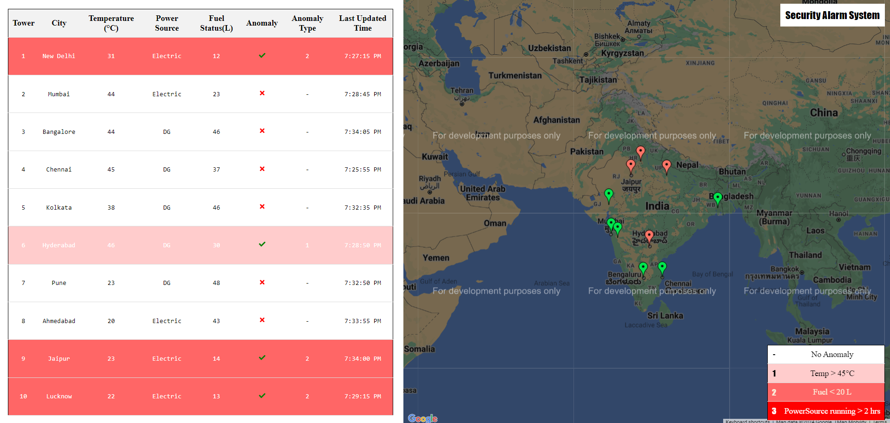

# Security Alarm System for Mobile Tower



## Table of Content

- [Overview](#Overview)
- [Getting Started](#getting-started)
- [Backend System](#backend-system)
- [Frontend System](#frontend-system)
- [Contibutors](#contributors)

## Overview

This project involves building a security alarm system for a mobile tower using Node.js, Express, MongoDB,Node-Cron and Socket.io for the backend, and ReactJS,Socket.io-client and Google Maps API for the frontend.The IOT service generates sensor data randomly every X seconds, and post this data to backend service which identify anomalies and store data in MongoDB. The frontend displays alarms in real-time on a map and updates a data table with new sensor data

## Getting Started

1. Clone the repository

```bash
  git clone https://github.com/mrr-bajaj/security-alarm-system.git
```

2. Open the cloned repository in your preferred IDE (Eg. VS Code) with the root folder as `security-alarm-sytem\`.

3. Install dependecies for both client and server:

```bash
cd security-alarm-sytem
npm run install-app
```

4. Create environment variable files

   - For the client, create a .env file in the client folder with the following content:

   ```makefile
   GOOGLE_MAP_API=YOUR_GOOGLE_API_KEY
   ```

   - For the server, create a .env file in the server folder with the following content:

   ```makefile
   MONGODB_URI=MONGODB_ATLAS_URI
   ```

5. Start the application:

```bash
npm run start-app
```

This command will start the client, server and iot-server in separate terminals.

Alternate way to start the application

- To start client

```bash
npm run start-client
```

- To start server

```bash
npm run start-server
```

- To start IOT server

```bash
npm run start-iot-server
```

## Backend System

### Technologies Used

- Node.js
- Express
- MongoDB (Atlas)
- Node-Cron
- Socket.io
- Mongoose
- Axios
- CORS
- Nodemon
- Dotenv

### Features

#### 1. Random Sensor Data Generation

The IOT service generates and post sensor data to backend server every X seconds for random tower with the following parameters:

```
Tower Number
Tower Location (Latitude and Longitude)
Tower Temperature (in Celsius)
Power Source (DG/Electric)
Fuel Status (in liters)
City
Time (in Date)
```

#### 2. Anomaly Detection

Anomalies are introduced in the sensor data generation process:

- If temperature exceeds 45 degrees Celsius
- If fuel level drops below 20 liters
- If the power source (DG) runs continuously for more than 2 hours

#### 3. Backend Processing

- Use Node-Cron for job scheduling to create and post data to backend every X seconds.
- Backend service reads and detect anomaly and post it to Mongodb.
- Read messages from MongoDB in the backend after every X seconds and sents it to client through Job Scheduling.
- Establish real-time communication with the frontend using Socket.io for live updates.

## Frontend System

### Technologies Used

- ReactJS
- Redux Toolkit
- Socket.io-client
- Google Maps API

### User Interface

The frontend displays alarms and sensor data in real-time:

#### Landing Page

- Uses a Geo Map to show alarms based on anomalies detected in sensor data.
- Alarms are generated and displayed in real-time on the map.
- Data table shows all sensor data and refreshes automatically when new sensor data is received
- When hovering over a marker icon on the map, the corresponding row in the table will be highlighted

## Contributors

Shubham Bajaj
